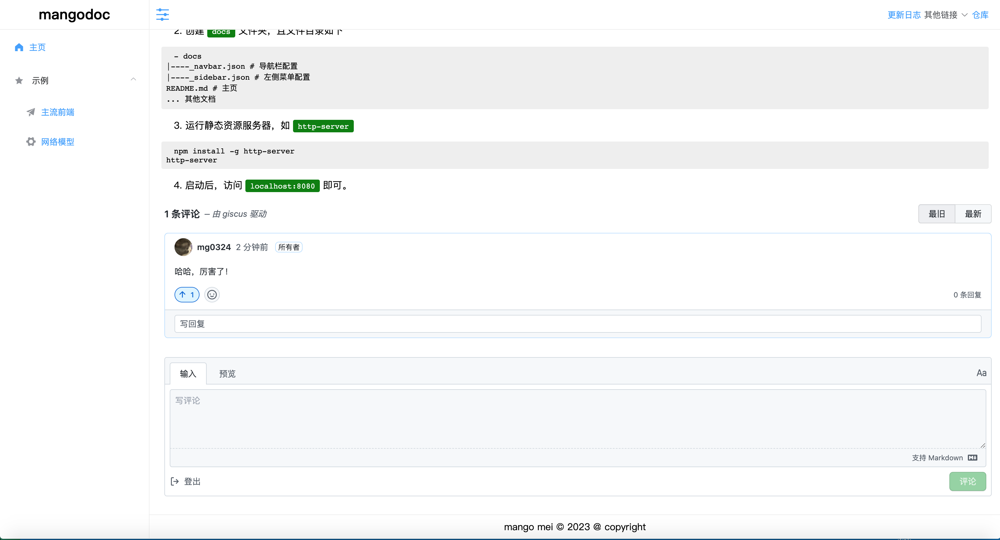

# mangodoc-giscus
mangodoc giscus plugin，集成giscus评论插件！

[](https://www.npmjs.com/package/mangodoc-giscus)




## Usage
1. [Applay giscus](https://giscus.app/zh-CN) ，申请 giscus

2. Configure mangodoc-giscus:(配置值详情请参考 https://giscus.app/zh-CN ）

    ```html
    <script>
    window.$mangodoc = {
      giscus:{
        repo: "mg0324/mangodoc-note-01",
        repoId: "R_kgDOI4bELQ",
        category: "Announcements",
        categoryId: "DIC_kwDOI4bELc4CT_Su",
        mapping: "url",
        reactionsEnabled: "0",
        strict: "1",
        emitMetadata: "0",
        inputPosition: "bottom",
        theme: "light",
        lang: "zh-CN",
        loading: "lazy"
      },
    }
    </script>
    ```

3. Insert script into mangodoc document:

    ```html
    <!-- giscus评论  -->
    <link rel="stylesheet" href="https://unpkg.com/mangodoc-giscus@1.0.0/dist/giscus.css">
    <script src="https://unpkg.com/mangodoc-giscus@1.0.0/dist/mangodoc-giscus.min.js"></script>
    ```
